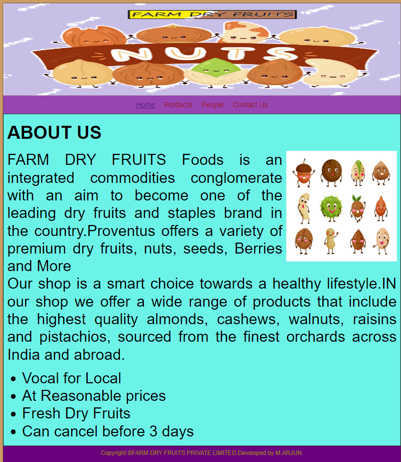
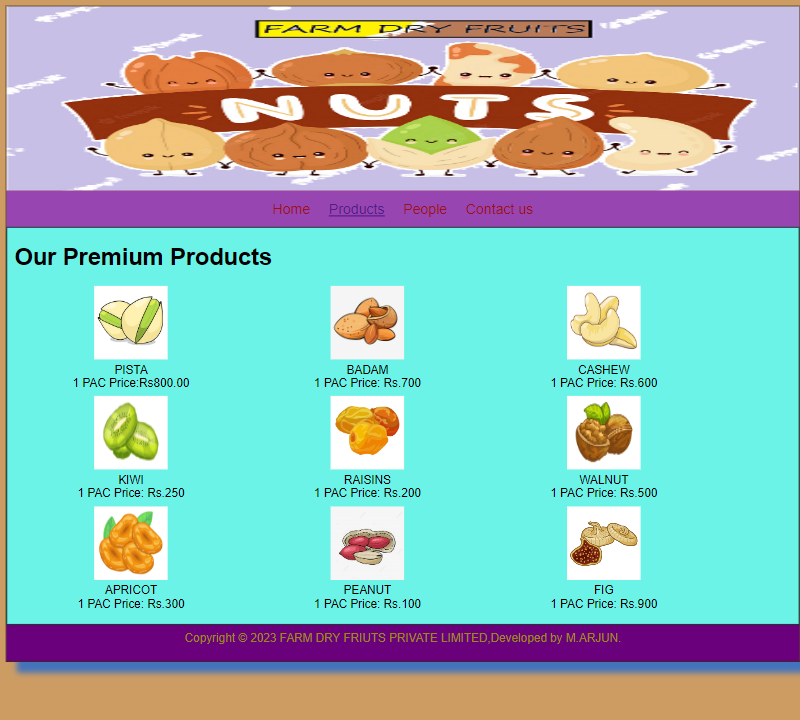
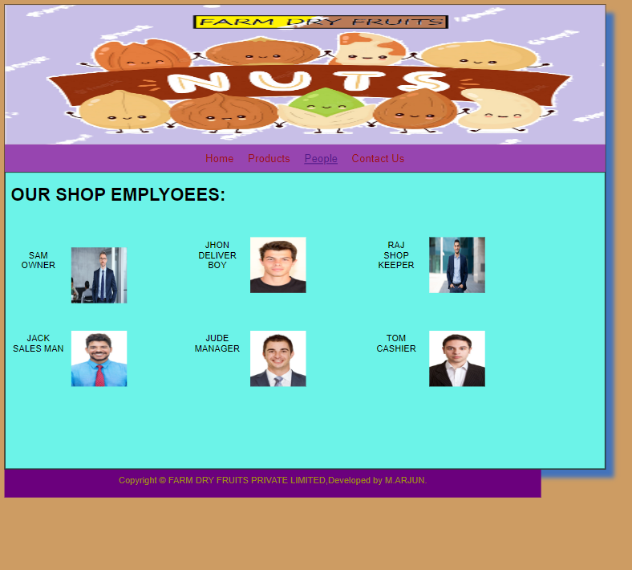
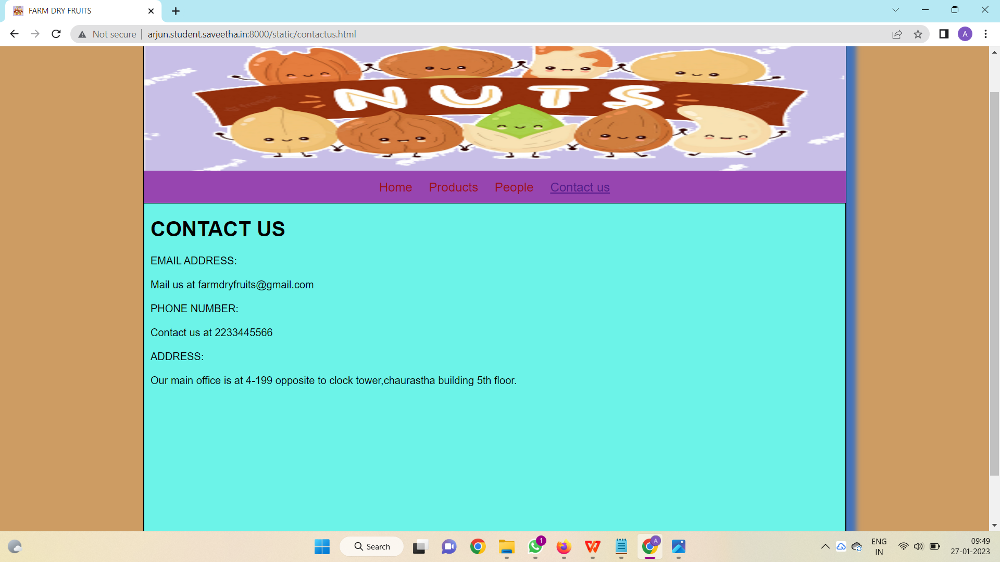

# Web Design for a Software Product Company

## AIM:

To design a static website for a software product company company.

## DESIGN STEPS:

### Step 1:

Requirement collection.

### Step 2:

Creating the layout using HTML and CSS.

### Step 3:

Updating the sample content.

### Step 4:

Choose the appropriate style and color scheme.

### Step 5:

Validate the layout in various browsers.

### Step 6:

Validate the HTML code.

### Step 6:

Publish the website in the given URL.

## PROGRAM :

 # CSS CODE:
```* {
  box-sizing: border-box;
  font-family: Arial, Helvetica, sans-serif;
}
body {
  background-color: #b7701eb0;
   
}
.container {
  width: 1080px;
  margin-left: auto;
  margin-right: auto;
  border-width: 1px 1px 1px 1px;
  border-style: solid;
  box-shadow: 15px 15px 8px rgba(9, 98, 224, 0.704);
}

.banner {
  display: block;
  width: 100%;
  height: 250px;
  text-align: center;
  font-size: 60px;
  background-image: url("/static/img/icon.png");
  background-size: 100% 100%;
  margin: 0px 0px 0px 0px;
  padding-top: 150px;
  color: #16d1ae;
}

.menu {
  display: block;
  width: 100%;
  height: 50px;
  font-size: larger;
  background-color: #9745b0;
  text-align: center;
  padding-top: 15px;
  margin: 0px 0px 0px 0px;
  border-width: 1px;
}

.menuitem {
  display: inline-block;
  margin-left: 10px;
  margin-right: 10px;
}
.menuitemselected {
  display: inline-block;
  margin-left: 10px;
  margin-right: 10px;
  color: #d11689;
}

.menuitem a {
  text-decoration: none;
  color: #9c1018;
}

.content {
  display: block;
  width: 100%;
  background-color: #6cf3e8;
  min-height: 500px;
  margin: 0px 0px 0px 0px;
  border-width: 1px;
  border-color: rgb(140, 230, 24)55, 255, 255);
  border-style: solid;
  }
.homecontent {
  min-height: 500px;
  margin: 10px 10px 10px 10px;
}
.homecontent h1 {
  text-align: left;
}
.homecontent img {
  float: right;
  width: 300px;
  height: 300px;
  margin-left: 10px;
}

.contenttext {
  text-align: justify;

}

.productcontent {
  min-height: 500px;
  margin: 10px 10px 10px 10px;
}

.productcontent h1 {
  text-align: left;
}

.productitems {
  display: block;
}

.productitem {
  display: inline-block;
  width: 30%;
  height: 150px;
  text-align: center;
}

.productitem img {
  width: 100px;
  height: 100px;
  display: block;
}
.productitem .itemimage {
  display: block;
  margin-left: auto;
  margin-right: auto;
  width: 100px;
  margin-bottom: 5px;
}

.productitem .itemname {
  display: block;
}
.productitem .itemprice {
  display: block;
}

.footer {
  display: block;
  width: 100%;
  height: 50px;
  background-color: #6b007d;
  text-align: center;
  padding-top: 10px;
  margin: 0px 0px 0px 0px;
  color: #9c8910;
}
```

# HOME PAGE HTML CODE:

```
<!DOCTYPE html>
<head>
    <title>FARM DRY FRUITS</title>
    <link rel="stylesheet" href="./css/layout.css" />
        <link rel="icon" href="./img/icon.png" type="image/x-icon" /

  <body>
    <div class="container">
      <div class="banner"></div>
      <div class="menu">
        <div class="menuitemselected"><a href="/static/home.html">Home</a></div>
        <div class="menuitem"><a href="/static/products.html">Products</a></div>
        <div class="menuitem"><a href="/static/people.html">People</a></div>
        <div class="menuitem"><a href="/static/contactus.html">Contact Us</a></div>
      </div>
      <div class="content">
        <div class="homecontent">
          <h1>ABOUT US</h1>
          
          <div class="contenttext">
            FARM DRY FRUITS Foods is an integrated commodities conglomerate with an aim to become one of the leading dry fruits 
            and staples brand in the country.Proventus offers a variety of premium dry fruits, nuts, seeds, Berries and More
            <br />
           Our shop is a smart choice towards a healthy lifestyle.IN our shop we offer a wide
           range of products that include the highest quality almonds, cashews, walnuts,
           raisins and pistachios, sourced from the finest orchards across India and abroad.
            <ul>
              <li>Vocal for Local</li>
              <li>At Reasonable prices</li>
              <li>Fresh Dry Fruits</li>
              <li>Can cancel before 3 days</li>
            </ul>
          </div>
        </div>
      </div>
      <div class="footer">
        Copyright &#169;FARM DRY FRUITS PRIVATE LIMITED,Developed by M.ARJUN.
      </div>
    </div>
  </body>
</html>
```
# PRODUCT PAGE HTML CODE:

```
<!DOCTYPE html>
<html lang="en">
  <head>
    <title>FARM DRY FRUITS</title>
    <link rel="stylesheet" href="./css/layout.css" />
    <link rel="icon" href="./img/icon.png" type="image/x-icon" />
    </head>

  <body>
    <div class="container">
      <div class="banner"></div>
      <div class="menu">
        <div class="menuitem"><a href="/static/home.html">Home</a></div>
        <div class="menuitemselected"><a href="/static/products.html">Products</a></div>
         <div class="menuitem"><a href="/static/people.html">People</a></div>
         <div class="menuitem"><a href="/static/contactus.html">Contact us</a></div>
        </div>
      <div class="content">
        <div class="productcontent">    
          <h1>Our Premium Products</h1>
          <div class="productitems">
              <div class="productitem"> 
                  <div class="itemimage">
                  
                  </div>
                  <div class="itemname">PISTA</div>
                  <div class="itemprice">1 PAC Price:Rs800.00 </div>
              </div>
              <div class="productitem"> 
                  <div class="itemimage">
                  
                  </div>
                  <div class="itemname">BADAM</div>
                  <div class="itemprice">1 PAC Price: Rs.700 </div>
              </div>
              <div class="productitem"> 
                  <div class="itemimage">
                  
                  </div>
                  <div class="itemname">CASHEW</div>
                  <div class="itemprice">1 PAC Price: Rs.600 </div>
              </div>
              <div class="productitem"> 
                  <div class="itemimage">
                  
                  </div>
                  <div class="itemname">KIWI</div>
                  <div class="itemprice">1 PAC Price: Rs.250 </div>
              </div>
              <div class="productitem"> 
                  <div class="itemimage">
                  
                  </div>
                  <div class="itemname">RAISINS</div>
                  <div class="itemprice">1 PAC Price: Rs.200 </div>
              </div>
              <div class="productitem"> 
                  <div class="itemimage">
                  
                  </div>
                  <div class="itemname">WALNUT</div>
                  <div class="itemprice">1 PAC Price: Rs.500 </div>
              </div>
              <div class="productitem"> 
                  <div class="itemimage">
                  
                  </div>
                  <div class="itemname">APRICOT</div>
                  <div class="itemprice">1 PAC Price: Rs.300 </div>
              </div>
              <div class="productitem"> 
                  <div class="itemimage">
                  
                  </div>
                  <div class="itemname">PEANUT</div>
                  <div class="itemprice">1 PAC Price: Rs.100 </div>
              </div>
              <div class="productitem"> 
                  <div class="itemimage">
                  
                  </div>
                  <div class="itemname">FIG</div>
                  <div class="itemprice">1 PAC Price: Rs.900 </div>
              </div>

          </div>
          </div>        
      </div>
      <div class="footer">
        Copyright &#169; 2023 FARM DRY FRIUTS PRIVATE LIMITED,Developed by M.ARJUN.
      </div>
    </div>
  </body>
</html>
```

# PEOPLE PAGE HTML CODE

```
<!DOCTYPE html>
<html lang="en">
  <head>
    <title>FARM DRY FRUITS</title>
    <link rel="stylesheet" href="./css/layout.css" />
        <link rel="icon" href="./img/icon.png" type="image/x-icon" /
    </head>
    <body>
    <div class="container">
      <div class="banner"></div>
      <div class="menu">
        <div class="menuitem"><a href="/static/home.html">Home</a></div>
        <div class="menuitem"><a href="/static/products.html">Products</a></div>
        <div class="menuitemselected"><a href="/static/people.html">People</a></div>
        <div class="menuitem"><a href="/static/contactus.html">Contact Us</a></div>
        </div>
      <div class="content">
        <div class="homecontent">
          <h1>OUR SHOP EMPLYOEES:</h1><br><br>
          <div class="productitems">
            <div class="productitem"> 
                <div class="itemimage">
                
                </div>
                <div class="itemname">SAM</div>
                <div class="itemprice">OWNER </div>
            </div>
            <div class="productitem"> 
                <div class="itemimage">
                
                </div>
                <div class="itemname">JHON</div>
                <div class="itemprice">DELIVER BOY</div>
            </div>
            <div class="productitem"> 
              <div class="itemimage">
              
              </div>
              <div class="itemname">RAJ</div>
              <div class="itemprice">SHOP KEEPER </div>
            </div>
            <div class="productitem"> 
              <div class="itemimage">
               
              </div>
              <div class="itemname">JACK</div>
              <div class="itemprice">SALES MAN</div>
          </div>
          <div class="productitem"> 
            <div class="itemimage">
             
            </div>
            <div class="itemname">JUDE</div>
            <div class="itemprice">MANAGER</div>
        </div>  <div class="productitem"> 
          <div class="itemimage">
            
          </div>
          <div class="itemname">TOM</div>
          <div class="itemprice">CASHIER</div>
      </div>
          </div>
        </div>
        </div>        
    </div>
    <div class="footer">
     Copyright &#169; FARM DRY FRUITS PRIVATE LIMITED,Developed by M.ARJUN.
    </div>
  </div>
</body>
</html>

```

# CONTACT US PAGE HTML CODE:

```
<!DOCTYPE html>
<html lang="en">
  <head>
        <title>FARM DRY FRUITS</title>
    <link rel="stylesheet" href="./css/layout.css" />
    <link rel="icon" href="./img/icon.png" type="image/x-icon" />
  </head>

  <body>
    <div class="container">
      <div class="banner"></div>
      <div class="menu">
        <div class="menuitem"><a href="/static/home.html">Home</a></div>
        <div class="menuitem"><a href="/static/products.html">Products</a></div>
        <div class="menuitem"><a href="/static/people.html">People</a></div>
        <div class="menuitemselected"><a href="/static/contactus.html">Contact us</a></div>
      </div>
      <div class="content">
        <div class="homecontent">
          <h1>CONTACT US</h1>
       
          <div class="contenttext">
           EMAIL ADDRESS:   
           <br><br>
           Mail us at  farmdryfruits@gmail.com
           <br><br>
           PHONE NUMBER:
           <br><br>
           Contact us at 2233445566
           <br><br>
           ADDRESS:
           <br><br>
           Our main office is at 4-199 opposite to clock tower,chaurastha building 5th floor.
          </div>
        </div>
      </div>
      <div class="footer">
        Copyright &#169;2023 FARM DRY FRIUTS PRIVATE LIMITED,Developed by M.ARJUN.
      </div>
    </div>
  </body>
</html>

```


## OUTPUT:
 
###  HOME PAGE:



### PRODUCT PAGE:



### PEOPLE PAGE:



### CONTACT US PAGE:



### HTML VALIDATION:


## Result:

Thus a website is designed for the Nut product company and the HTML,CSS code are validated.
